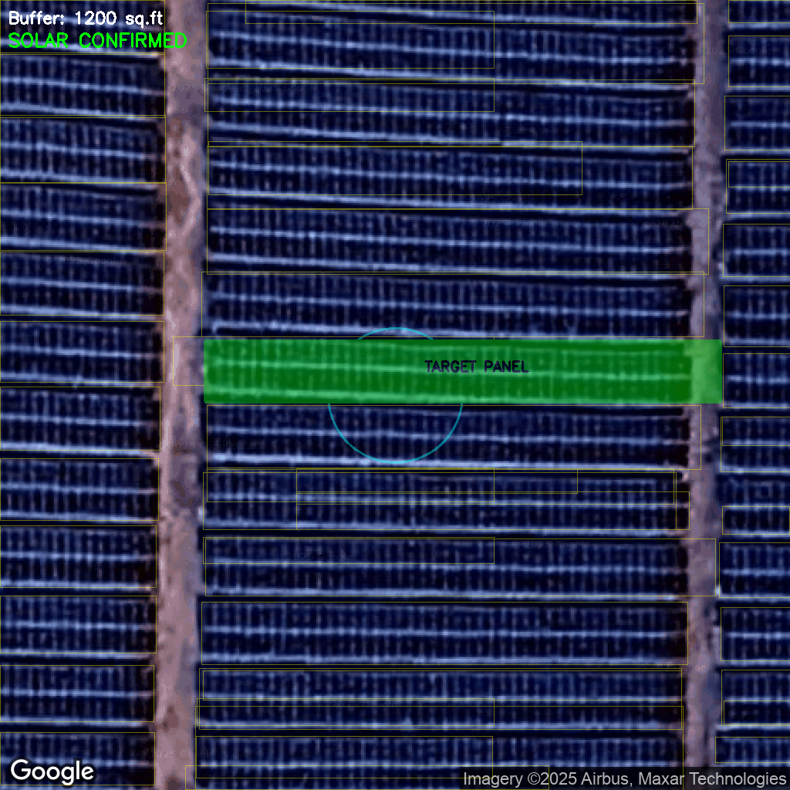

# Solar Panel Detection Pipeline
**EcoInnovators Ideathon 2026 - College Edition**

## 1. Executive Summary

This repository contains an end-to-end computer vision pipeline developed for the automated remote verification of rooftop solar installations (PM Surya Ghar: Muft Bijli Yojana). The system accepts geographic coordinates, retrieves high-resolution satellite imagery, executes deep learning inference, and performs geospatial validation to confirm the presence of photovoltaic systems.

The solution utilizes a custom-trained YOLOv8-Medium model integrated with Slicing Aided Hyper Inference (SAHI) to detect small-scale objects in satellite imagery. It adheres to specific auditability requirements, including dynamic buffer zone analysis (1200 sq.ft and 2400 sq.ft) and automated quality control.


## 2. Installation and Environment Setup

The pipeline is optimized for **Python 3.10.1**.

### Option A: Standard Pip Installation
If using a standard Python environment:

```bash
# Ensure Python 3.10.1 is active
pip install -r environment_details/requirements.txt
```

### API Configuration
Create a `.env` file in the root directory. You must provide a valid Google Maps Static API Key for image retrieval.

```ini
# Google Maps API Configuration
GOOGLE_MAPS_API_KEY=your_api_key_here

MODEL_PATH=model/best.pt
CONFIDENCE_THRESHOLD=0.25
ZOOM_LEVEL=20
INPUT_FOLDER=input_folder
OUTPUT_FOLDER=predictions
```

## 3. Usage Instructions

### Step 1: Prepare Input Data
Place your input Excel file (`.xlsx`) inside the `input_folder/`.
The file must contain the following columns:
*   `sample_id`: Unique identifier for the location.
*   `latitude`: WGS84 latitude.
*   `longitude`: WGS84 longitude.

### Step 2: Execute Pipeline
Run the main script from the root directory:

```bash
python main.py
```

### Step 3: Access Results
The system will process the images and save results in the `predictions/`.
*   **JSON:** Contains the binary classification (`has_solar`), confidence score, estimated area ($m^2$), and QC status.
*   **Overlay Image:** A visualization showing the buffer zones and detected panels.

## 4. Technical Architecture and Logic

The pipeline operates in four distinct phases to ensure accuracy and explainability.

### Phase 1: Data Acquisition
The system accepts `(lat, lon)` coordinates and queries the Google Maps Static API. It retrieves a $1024 \times 1024$ pixel satellite image at Zoom Level 20. This zoom level provides sufficient Ground Sampling Distance (GSD) to resolve individual PV modules.

### Phase 2: Quality Control (QC) Layer
Before inference, the `ImageQualityChecker` module analyzes the image to prevent false negatives caused by poor data quality.
*   **Brightness Check:** Detects images that are too dark (shadows) or overexposed.
*   **Cloud Detection:** Analyzes pixel intensity distribution to detect cloud occlusion.
*   **Outcome:** If an image fails these checks, the status is set to `NOT_VERIFIABLE`.

### Phase 3: Slicing Aided Hyper Inference (SAHI)
To detect small objects effectively, the pipeline uses SAHI. The `1024px` input image is sliced into overlapping $640 \times 640$ windows. The YOLOv8 model processes each slice independently. Predictions are then merged using Non-Maximum Suppression (NMS) to reconstruct the full detection map.

### Phase 4: Geometric Verification (Buffer Logic)
The system implements the geospatial logic defined in the challenge requirements:
1.  **Buffer Zone 1 (1200 sq.ft):** The system calculates a pixel radius corresponding to 1200 sq.ft centered on the target coordinate. If a panel overlaps this area, it is confirmed.
2.  **Buffer Zone 2 (2400 sq.ft):** If no panel is found in Zone 1, the search radius expands to 2400 sq.ft.
3.  **Area Estimation:** If a panel is detected, its pixel area is converted to square meters based on the latitude-specific projection scale.

## 6. Output Artifacts

### JSON Output
The `all_predictions.json` file contains structured data for automated auditing:

```json
{
    "sample_id": 1001,
    "lat": 12.9716,
    "lon": 77.5946,
    "has_solar": true,
    "confidence": 0.915,
    "pv_area_sqm_est": 24.5,
    "buffer_radius_sqft": 1200,
    "qc_status": "VERIFIABLE",
    "bbox_or_mask": "[[267.0, 442.13], [933.92, 442.13], [933.92, 520.62], [267.0, 520.62], [267.0, 442.13]]",
    "image_metadata": {
        "source": "Google Maps Static API",
        "quality_check": "Good quality"
    }
}
```

### Visual Verification
The system generates overlay images (`sample_id_overlay.png`) for manual review:
*   **Blue Circle:** Indicates the buffer zone used for verification.
*   **Yellow Outline:** Indicates all detected solar panels.
*   **Green Fill:** Indicates the specific panel that triggered the positive verification.



## 7. Model Performance

The model was trained on a composite dataset combining Roboflow 100, LSGI547, and other open-source libraries.

| Metric | Value | Description |
|:-------|:------|:------------|
| **mAP@50** | 0.915 | Mean Average Precision at 0.5 IoU |
| **Precision** | 0.877 | Positive Predictive Value |
| **Recall** | 0.837 | Sensitivity |
| **F1 Score** | 0.857 | Harmonic mean of Precision and Recall |

## 8. License and Attribution

*   **Code License:** MIT License.
*   **Imagery:** Google Maps Static API. Usage must comply with Google's Terms of Service.
